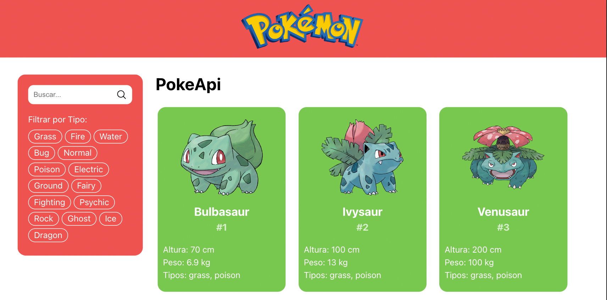

# PokeAPI Viewer

Este es un proyecto creado con **Vite.js** y **Vanilla JavaScript** que muestra 150 Pokémon obtenidos desde la PokeAPI. El proyecto incluye un filtro para buscar Pokémon por nombre o por tipo.
Fue desarrollado para el curso Principios de Diseño y Desarrollo Web del Diplomado en Full Stack de IPSS.



## 🚀 Características

- **Lista de Pokémon**: Muestra los primeros 150 Pokémon obtenidos desde la PokeAPI.
- **Filtro por nombre**: Busca Pokémon escribiendo parte del nombre en el campo de búsqueda.
- **Filtro por tipo**: Filtra los Pokémon según su tipo (agua, fuego, planta, etc.).

## 🛠️ Tecnologías utilizadas

- **Vite.js**: Herramienta para construir el proyecto.
- **Vanilla JavaScript**: Para la lógica de la aplicación.
- **CSS**: Para el diseño y estilo.
- **PokeAPI**: Fuente de los datos sobre los Pokémon.

## 🧑‍💻 Instalación y uso

1. Clona este repositorio:
   ```bash
   git clone https://github.com/pabarca88/pokeapi2.git
   cd pokeapi2

2. Instala las dependencias
   ```bash
   npm install

3. Inicia el servidor de desarrollo:
   ```bash
   npm run dev

4. Abre la aplicación en tu navegador en http://localhost:5173.

## 🔍 Funcionalidades
### Filtro por nombre
Escribe el nombre completo o parcial de un Pokémon en el campo de búsqueda.
Los resultados se actualizan automáticamente para mostrar solo los Pokémon coincidentes.

### Filtro por tipo
Selecciona un tipo de Pokémon del menú desplegable.
La lista se actualiza para mostrar solo los Pokémon de ese tipo.

¡Gracias por probar este proyecto!